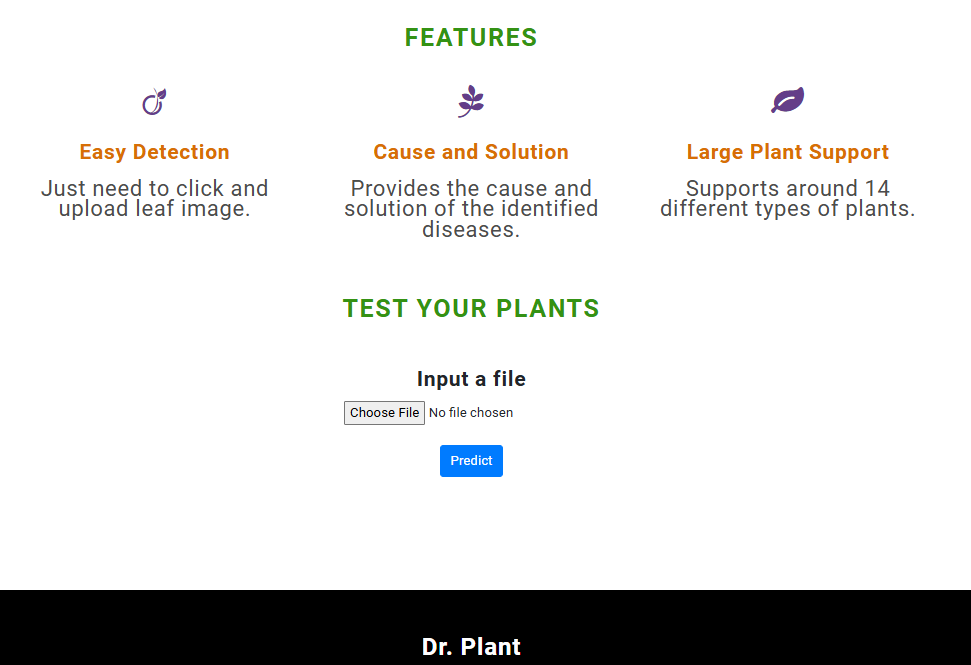
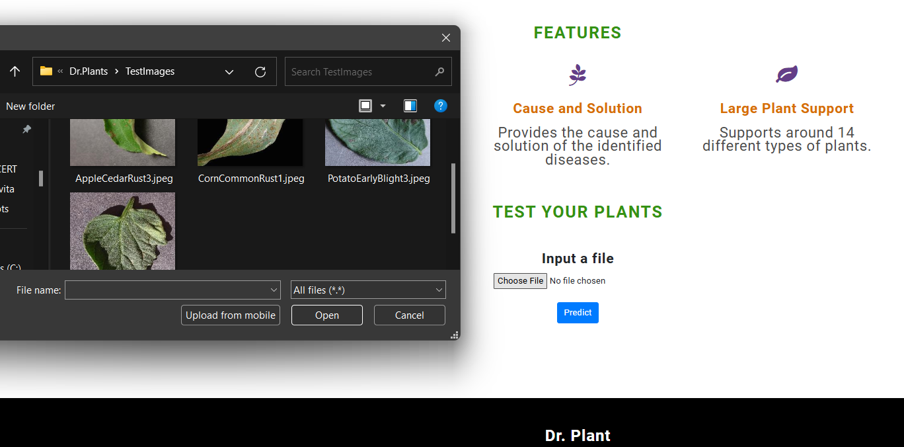
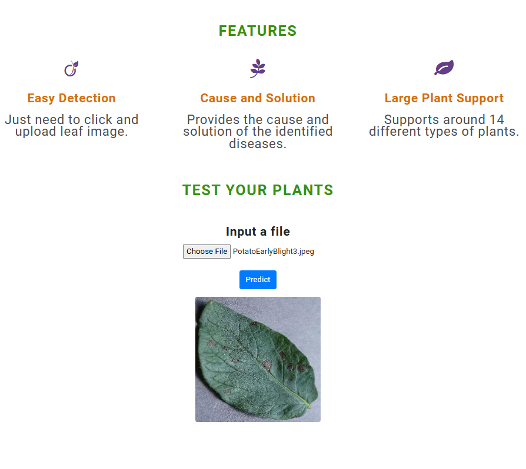
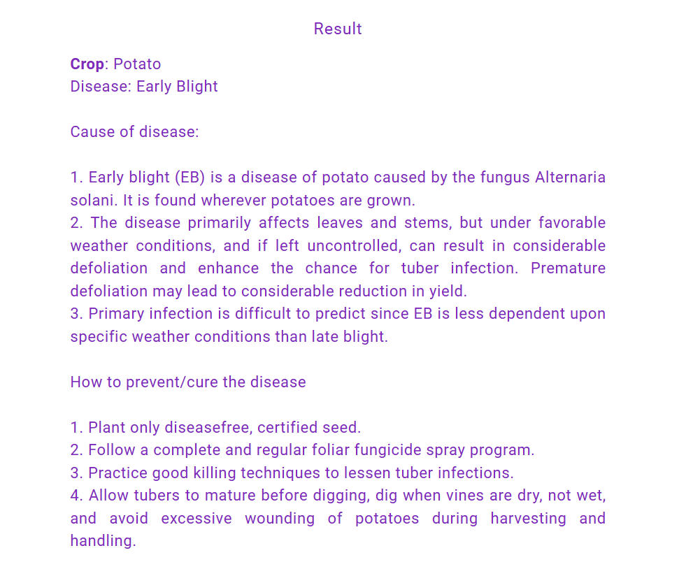

## Dr.PLANT [Recognition of Plant Diseases]

## Table of Contents
1. [Description](#description)
2. [Leaf Image Classification](#leaf-image-classification)
3. [Details about the Model](#details-about-the-model)
4. [Prototype Screenshots](#prototype-screenshots)
5. [Usage](#usage)
6. [How to Run Locally](#how-to-run-locally)
7. [Tech Stack](#tech-stack)
8. [License](#license)
9. [Support](#support)

## Description

This project aims to develop a plant disease recognition model based on leaf image classification using deep convolutional networks. The model can recognize<strong> 38 different types of plant diseases from 14 different plants and distinguish plant leaves from their surroundings. The real-time response is 0.1 seconds.</strong>

## Leaf Image Classification

### 

This process involves building a model to detect diseases associated with leaf images. The key points are:

1. **Data Gathering**: The dataset used is **"New Plant Diseases Dataset"**. It can be downloaded from [Kaggle](https://www.kaggle.com/vipoooool/new-plant-diseases-dataset). It contains images of different healthy and unhealthy crop leaves.
 

2. **Model Building**:
   - The model is built using PyTorch.
   - Three models were used:
     1. CNN model architecture includes <strong>CNN Layer, Max Pooling, Flatten, and Linear Layers</strong>.
     2. Transfer learning with <strong>VGG16 Architecture</strong>.
     3. Transfer learning with <strong>ResNet34 Architecture</strong>.
 

3. **Training**: The model was trained using variants of the layers mentioned above and by varying hyperparameters. The best model achieved a test <strong>accuracy of 98.42%.</strong>
 

4. **Testing**: The model was tested on 17,572 images of 38 classes. Sample predictions can be seen below:
   

   
   
   

 

5. **Model Architectures and Performance**: Various model architectures, learning rates, and optimizers were tried, with different accuracy levels obtained.

## Details about the Model

The model can detect `38` types of `diseases` in `14 unique plants`.

- See the detailed list of plants and diseases in [List](Src).

## Prototype Screenshots

Here are some screenshots of the prototype in action:
1. Showing page:
   
2. Input image from file explorer:
   
3. After input showing image:
   
4. Output:
   

## Usage:

- `Flask`: Code for Flask Server and deployment.
- `TestImages`: Sample images for model testing.
- `Src`: All source code for building models.
- `Models`: All pre-trained models in PyTorch.

## How to Run Locally 🛠️
1. Ensure you have [git](https://git-scm.com/download) installed.
2. Clone the project:
   `git clone https://github.com/hackelite01/Dr.Plants`
   `cd Dr.Plants/Flask`
3. Create and activate a Python virtual environment:
   `python -m venv venv venv\Scripts\activate # On Windows source venv/bin/activate # On Unix or MacOS`
4. Install the required dependencies:
   `pip install -r requirements.txt`
5. Run the project:
   `python app.py`

6. Open the provided localhost URL in your web browser.

## Tech Stack

### Front-End
- HTML
- CSS
- JavaScript

### Back-End
- Python Flask

## License

This project is licensed under the `MIT` License.

### Show your support

Give a ⭐ if you like this project!

