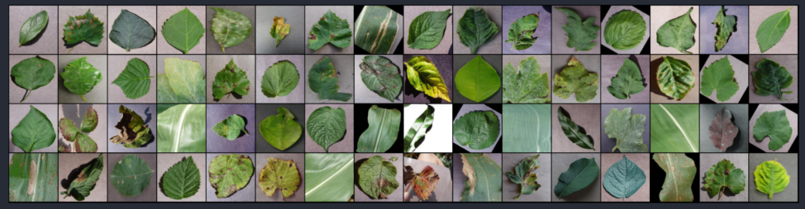
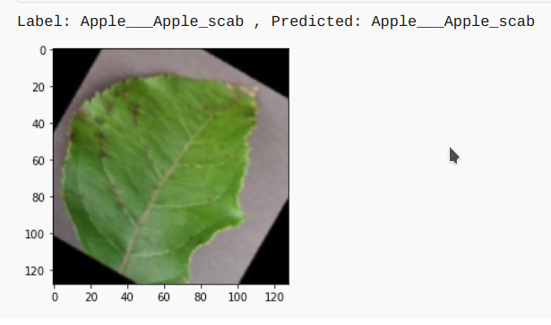
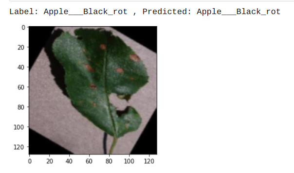

<div align="center">

## Dr.PLANT [Recognition of Plant Diseases]

[](https://www.codefactor.io/repository/github/hackelite01/dr.plants/overview/main)

 </div>

## Description

This project is an approach to the development of plant disease recognition model, based on leaf image classification, by the
use of deep convolutional networks. The developed model is able to recognize 38 different types of plant diseases out of of 14 different plants with the ability to distinguish plant leaves from their surroundings.

## Leaf Image Classification

## 

This process for building a model which can detect the disease assocaited with the leaf image. The key points to be followed are:

1. Data gathering

   The dataset taken was **"New Plant Diseases Dataset"**. It can be downloaded through the link "https://www.kaggle.com/vipoooool/new-plant-diseases-dataset". It is an Image dataset containing images of different healthy and unhealthy crop leaves.

2. Model building

   - I have used pytorch for building the model.
   - I used three models:-
     1. The CNN model architecture consists of CNN Layer, Max Pooling, Flatten a Linear Layers.
     2. Using Transfer learning VGG16 Architecture.
     3. Using Transfer learning resnet34 Architecture.

3. Training

   The model was trained by using variants of above layers mentioned in model building and by varying hyperparameters. The best model was able to achieve 98.42% of test accuracy.

4. Testing

   The model was tested on total 17572 images of 38 classes.<br/>
   The model used for prediction on sample images. It can be seen below:
   <!--  -->
   <div>
   
   
   </div>

5. Various Model Architecture tried along with Learning Rate and Optimizer and various accuracy obtained with different models.

<br/>

## Details about the model

### The model will be able to detect `38` types of `diseases` of `14 Unique plants`

- The detail list of plants and diseases can be seen in [List](Src)

## Usage:

- `Flask` : Code for Flask Server and deployment
- `TestImages` : Sample image for model testing
- `Src` : All The source code for building models
- `Models` : All the Pretrained Models of Pytorch

## How to run locally 🛠️
- Before the following steps make sure you have [git](https://git-scm.com/download), [Anaconda](https://www.anaconda.com/) or [miniconda](https://docs.conda.io/en/latest/miniconda.html) installed on your system
- Clone the complete project with `git clone https://github.com/hackelite01/Dr.Plants` or you can just download the code and unzip it
- **Note:** The master branch doesn't have the updated code used for deployment, to download the updated code used for deployment you can use the following command
  ```
  ❯ git clone -b deploy https://github.com/hackelite01/Dr.Plants
  ```
- `deploy` branch has only the code required for deploying the app (rest of the code that was used for training the models, data preparation can be accessed on `master` branch)
- It is highly recommended to clone the deploy branch for running the project locally (the further steps apply only if you have the deploy branch cloned)
- Once the project is cloned, open anaconda prompt in the directory where the project was cloned and paste the following block
  ```
  conda create -n Dr.Plants python=3.6.12
  pip install -r requirements.txt
  conda activate Dr.Plants
  ```
- And finally run the project with
  ```
  python app.py
  ```
- Open the localhost url provided after running `app.py` and now you can use the project locally in your web browser.

# Tech Stack

## Front-End
HTML <br>
CSS <br>
JavaScript<br>
## Back-End
Python Flask

## Team

Mayank Rajput = Back-End Developer <br>
Jayesh Pansuriya = Back-End Developer <br>
Pallav Chavda = Front-End Developer <br>
Krish Dhanani = Front-End Developer <br>
Vaibhav Shah = Tester ( All ground level work )

## License

This project is Licensed under `MIT`

### Show your support

Give a ⭐ if you like this website!

<a href="https://www.buymeacoffee.com/hackelite01" target="_blank"></a>
